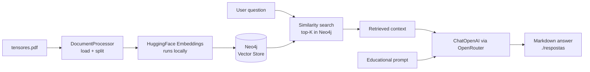

# embeddings-neo4j-rag-python

[Português](README.md) · [**English**](README.en.md)

[](LICENSE)
[](https://www.python.org/)
[](https://python.langchain.com/)
[](https://neo4j.com/)

> A Python RAG (Retrieval-Augmented Generation) pipeline that indexes a PDF into a Neo4j vector store using local embeddings and answers questions with an LLM via OpenRouter. Python port of the original TypeScript example.

---

## Architecture



## In one sentence

It loads `tensores.pdf`, splits it into chunks, generates local embeddings, stores everything as vectors in Neo4j and, for each question, retrieves the most relevant passages and asks an LLM for an educational answer in Portuguese — saving each answer under `respostas/`.

---

## Components

| File | Responsibility |
| --- | --- |
| `src/config.py` | Loads prompts, environment variables and parameters (chunking, Neo4j, embeddings, LLM). |
| `src/document_processor.py` | Loads the PDF (`PyPDFLoader`) and splits it into chunks (`RecursiveCharacterTextSplitter`). |
| `src/ai.py` | Vector retrieval in Neo4j + answer generation with the LLM (LCEL chain). |
| `src/main.py` | Orchestrates the pipeline: indexing, similarity search and writing the answers. |
| `prompts/answerPrompt.json` | Assistant role, task, instructions and constraints. |
| `prompts/template.txt` | Template of the final prompt sent to the LLM. |
| `docker-compose.yml` | Runs Neo4j 5.26 (Browser + Bolt) with the APOC plugin. |

## Ports and services

| Service | Port | Purpose |
| --- | --- | --- |
| Neo4j Browser | 7474 | Web UI to inspect the graph. |
| Neo4j Bolt | 7687 | Connection protocol used by the application. |

---

## Prerequisites

- Python 3.12 (`langchain-neo4j` does not support 3.14 yet).
- Docker + Docker Compose (for Neo4j).
- An [OpenRouter](https://openrouter.ai/keys) API key for the LLM.

## How to run

```bash
# 1. Virtual environment and dependencies
python3.12 -m venv .venv
source .venv/bin/activate
pip install -r requirements.txt

# 2. Configure environment variables
cp .env.example .env
# edit .env and fill in OPENROUTER_API_KEY

# 3. Start Neo4j
docker compose up -d --wait

# 4. Run the pipeline
python -m src.main

# 5. Tear down the infrastructure (removes volumes)
docker compose down --volumes
```

On the first run the embedding model is downloaded from HuggingFace (a few MB) and runs locally — there is no API cost for embeddings. Only answer generation uses the OpenRouter LLM.

---

## Sample output

Running `python -m src.main` indexes the PDF and processes each question:

```text
🚀 Inicializando sistema de Embeddings com Neo4j...

📄 Carregadas 7 páginas do PDF
✂️  Dividido em 19 chunks
🗑️  Removendo todos os documentos existentes...
✅ Documentos removidos com sucesso

✅ Base de dados populada com sucesso!

🔍 ETAPA 2: Executando buscas por similaridade...

================================================================================
📌 PERGUNTA: Como converter objetos JavaScript em tensores?
================================================================================
🔍 Buscando no vector store do Neo4j...
✅ Encontrados 3 resultados relevantes (melhor score: 0.771)
🤖 Gerando resposta com IA...

✅ Processamento concluído com sucesso!
```

Each answer is also saved to `respostas/resposta-<index>-<timestamp>.md`. Example (excerpt from `resposta-0`, the assistant answers in Portuguese by design):

> Para converter objetos JavaScript em tensores utilizando TensorFlow.js, você precisa
> transformar esses objetos em uma estrutura que contenha apenas números, já que os
> tensores são representações numéricas. (...)
>
> ```javascript
> const pessoas = [
>   { nome: "Erick", idade: 30, cor: "azul", localizacao: "São Paulo" },
>   { nome: "Ana", idade: 25, cor: "vermelho", localizacao: "Rio" },
> ];
> ```

---

## Configuration

All variables live in `.env` (see `.env.example`):

| Variable | Description | Example |
| --- | --- | --- |
| `NEO4J_URI` | Neo4j Bolt address. | `bolt://localhost:7687` |
| `NEO4J_USER` | Neo4j user. | `neo4j` |
| `NEO4J_PASSWORD` | Neo4j password. | `password` |
| `EMBEDDING_MODEL` | Local embedding model. | `sentence-transformers/all-MiniLM-L6-v2` |
| `OPENROUTER_API_KEY` | OpenRouter API key. | `sk-or-v1-...` |
| `NLP_MODEL` | LLM model. | `openai/gpt-4o-mini` |
| `OPENROUTER_SITE_URL` | Optional `HTTP-Referer` header. | `http://localhost` |
| `OPENROUTER_SITE_NAME` | Optional `X-Title` header. | `embeddings-neo4j-rag-python` |

The credentials in `.env.example` are for local development (the same as in `docker-compose.yml`) and must be replaced for any real usage.

---

## Structure

```text
embeddings-neo4j-rag-python/
├── docker-compose.yml       # Neo4j 5.26 + APOC
├── requirements.txt         # Python dependencies
├── .env.example             # environment variables template
├── tensores.pdf             # source document (knowledge base)
├── prompts/
│   ├── answerPrompt.json    # role, task, instructions and constraints
│   └── template.txt         # final prompt template
├── respostas/               # generated answers (.md)
└── src/
    ├── config.py            # central configuration
    ├── document_processor.py# PDF loading + chunking
    ├── ai.py                # retrieval + generation
    └── main.py              # pipeline entry point
```

---

## License

Distributed under the MIT License. See [LICENSE](LICENSE).

## Credits

Python port of the `exemplo-13-embeddings-neo4j-rag` example (originally in TypeScript by Erick Wendel) from the Software Engineering with Applied AI course.
