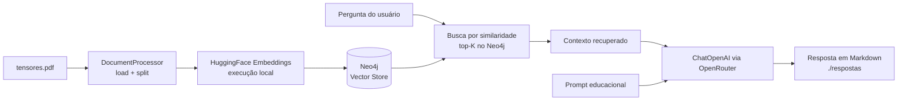

# embeddings-neo4j-rag-python

[**Português**](README.md) · [English](README.en.md)

[](LICENSE)
[](https://www.python.org/)
[](https://python.langchain.com/)
[](https://neo4j.com/)

> Pipeline de RAG (Retrieval-Augmented Generation) em Python que indexa um PDF em um vector store no Neo4j usando embeddings locais e responde perguntas com um LLM via OpenRouter. Porte em Python do exemplo original em TypeScript.

---

## Arquitetura



## Em uma frase

Carrega o `tensores.pdf`, fatia em chunks, gera embeddings locais, guarda tudo como vetores no Neo4j e, para cada pergunta, recupera os trechos mais relevantes e pede a um LLM uma resposta educacional em português — salvando cada resposta em `respostas/`.

---

## Componentes

| Arquivo | Responsabilidade |
| --- | --- |
| `src/config.py` | Carrega prompts, variáveis de ambiente e parâmetros (chunking, Neo4j, embeddings, LLM). |
| `src/document_processor.py` | Carrega o PDF (`PyPDFLoader`) e divide em chunks (`RecursiveCharacterTextSplitter`). |
| `src/ai.py` | Recuperação vetorial no Neo4j + geração da resposta com o LLM (chain LCEL). |
| `src/main.py` | Orquestra o pipeline: indexação, buscas por similaridade e escrita das respostas. |
| `prompts/answerPrompt.json` | Papel, tarefa, instruções e restrições do assistente. |
| `prompts/template.txt` | Template do prompt final enviado ao LLM. |
| `docker-compose.yml` | Sobe o Neo4j 5.26 (Browser + Bolt) com o plugin APOC. |

## Portas e serviços

| Serviço | Porta | Uso |
| --- | --- | --- |
| Neo4j Browser | 7474 | Interface web para inspecionar o grafo. |
| Neo4j Bolt | 7687 | Protocolo de conexão usado pela aplicação. |

---

## Pré-requisitos

- Python 3.12 (o `langchain-neo4j` ainda não suporta 3.14).
- Docker + Docker Compose (para o Neo4j).
- Uma chave da [OpenRouter](https://openrouter.ai/keys) para o LLM.

## Como rodar

```bash
# 1. Ambiente virtual e dependências
python3.12 -m venv .venv
source .venv/bin/activate
pip install -r requirements.txt

# 2. Configurar variáveis de ambiente
cp .env.example .env
# edite .env e preencha OPENROUTER_API_KEY

# 3. Subir o Neo4j
docker compose up -d --wait

# 4. Executar o pipeline
python -m src.main

# 5. Derrubar a infraestrutura (remove os volumes)
docker compose down --volumes
```

Na primeira execução o modelo de embeddings é baixado do HuggingFace (alguns MB) e roda localmente — não há custo de API para os embeddings. Apenas a geração de respostas usa o LLM da OpenRouter.

---

## Configuração

Todas as variáveis ficam em `.env` (veja `.env.example`):

| Variável | Descrição | Exemplo |
| --- | --- | --- |
| `NEO4J_URI` | Endereço Bolt do Neo4j. | `bolt://localhost:7687` |
| `NEO4J_USER` | Usuário do Neo4j. | `neo4j` |
| `NEO4J_PASSWORD` | Senha do Neo4j. | `password` |
| `EMBEDDING_MODEL` | Modelo de embeddings local. | `sentence-transformers/all-MiniLM-L6-v2` |
| `OPENROUTER_API_KEY` | Chave da OpenRouter. | `sk-or-v1-...` |
| `NLP_MODEL` | Modelo do LLM. | `openai/gpt-4o-mini` |
| `OPENROUTER_SITE_URL` | Header opcional `HTTP-Referer`. | `http://localhost` |
| `OPENROUTER_SITE_NAME` | Header opcional `X-Title`. | `embeddings-neo4j-rag-python` |

As credenciais em `.env.example` são de desenvolvimento local (as mesmas do `docker-compose.yml`) e devem ser trocadas em qualquer uso real.

---

## Estrutura

```text
embeddings-neo4j-rag-python/
├── docker-compose.yml       # Neo4j 5.26 + APOC
├── requirements.txt         # dependências Python
├── .env.example             # modelo de variáveis de ambiente
├── tensores.pdf             # documento-fonte (base de conhecimento)
├── prompts/
│   ├── answerPrompt.json    # papel, tarefa, instruções e restrições
│   └── template.txt         # template do prompt final
├── respostas/               # respostas geradas (.md)
└── src/
    ├── config.py            # configuração central
    ├── document_processor.py# carregamento + chunking do PDF
    ├── ai.py                # recuperação + geração
    └── main.py              # ponto de entrada do pipeline
```

---

## Licença

Distribuído sob a licença MIT. Veja [LICENSE](LICENSE).

## Créditos

Porte em Python do exemplo `exemplo-13-embeddings-neo4j-rag` (originalmente em TypeScript por Erick Wendel) do curso de Engenharia de Software com IA Aplicada.
